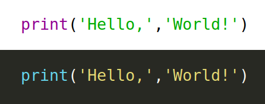

## Функция ```print```

По традиции первая программа, которую мы пишем на новом языке программирования -- это "Hello, World!". Ее задача вывести на экран приветствие. Это делается с помощью функции ```print```. Вот она на языке python:

    print('Hello, World!')

Обратите внимание, что фраза заключена в кавычки. Благодаря им компьютер понимает, что это просто строка, в которой ему не надо искать никакого смысла, а надо только вывести на экран. 

Скобки нужны для того, чтобы выделить аргументы функции, то есть то, что мы сообщаем функции. Аргументов может быть несколько. Функция ```print``` принимает сколько угодно аргументов и все их выводит на экран, разделяя пробелами. Например, вот эта программа (в ней функция получает два аргумента) выведет на этран то же самое:

Во многих редакторах строки выделяются цветом, например, в IDLE зеленым. Если этого не произошло, возможно вы ошиблись с кавычками.

А вот эта (каждая буква -- аргумент) не совсем то же самое, будут лишние пробелы:

    print('H','e','l','l','o',',','W','o','r','l','d','!')
