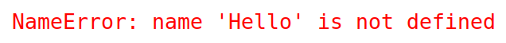

## Функция ```print```

По традиции первая программа, которую мы пишем на новом языке программирования -- это "Hello, World!". Ее задача вывести на экран приветствие. Это делается с помощью функции ```print```. Вот она на языке python:

    print('Hello, World!')

Обратите внимание, что фраза заключена в кавычки. Благодаря им компьютер понимает, что это просто строка, в которой ему не надо искать никакого смысла, а надо только вывести на экран. 

Скобки нужны для того, чтобы выделить аргументы функции, то есть то, что мы сообщаем функции. Аргументов может быть несколько. Функция ```print``` принимает сколько угодно аргументов и все их выводит на экран, разделяя пробелами. Например, вот эта программа (в ней функция получает два аргумента) выведет на этран то же самое:


Во многих редакторах строки выделяются цветом, например, в IDLE зеленым. Если этого не произошло, возможно вы ошиблись с кавычками.

Можем и вовсе все буквы разделить на разные строки. Будет 12 аргументов, а на экране мы увидим почти то же самое, но будет много пробелов:

    print('H','e','l','l','o',',','W','o','r','l','d','!')


## Переменные

Переменные -- это ячейки в памяти компьютера, в которых может храниться разнообразная информация. Чтобы что-то записать в переменную (присвоить ей значение), надо написать ее имя и символ оператора присвоения ```=```. Например так:

    a = 3
    N1 = 10
    word = 'name:'
    myName = 'Alex'
    number_of_words = 40

Как видите, в названиях переменных можно использовать буквы, цифры и знак подчеркивания ```_```. Но ничего больше.

Переменные можно использовать как аргументы функций:

    day = 2
    month = 'ноября'
    print('Сегодня',day,month)
    print('Завтра',day+1,month)

С переменными можно производить разные операции:

    x = 23
    y = 10
    a = x+y
    b = x*y
    c = x/y
    d = x//y
    e = x%y
    print(a,b,c,d,e)

Символ ```/``` означает деление, результатом является дробное число. Для деления с остатком используют два других знака: ```//``` дает неполное частное, а ```%``` -- остаток.


## Действия с числами и строками

Если бы мы в нашей первой программе не поставили кавычки, мы получили бы сообщение о синтаксической ошибке (SyntaxError: invalid syntax) из-за знака ```!``` после слова ```World```, которое компьютер воспринял бы как название переменной.

Если написать так, без восклицательного знака:

    print(Hello, World)

тоже будет сообщение об ошибке, но другое. Оно означает, что мы попытались обратиться к переменной ```Hello```, в которую не было ничего записано:


А вот если сделать так:

    Hello = 'Привет,'
    World = 'Мир!'
    print(Hello, World)

все будет работать. Только теперь ```Hello``` и ```World``` -- это имена переменных, а не части строки.
